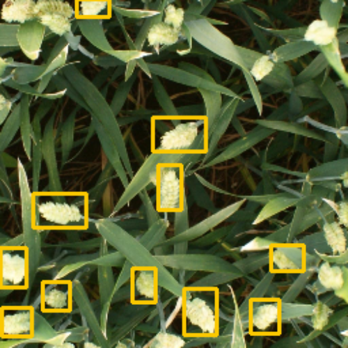

# WheatHead-Detection-YOLOV4
Trained Yolov4 using custom wheat-head dataset. 
Nowadays there are crop diseases that affect wheat crop greatly. We can automate the process and detect those diseases early. But for that we need to initially detect the wheat crop, only then we can further identify the crop damage. 
For this kaggle launched a competition where they expect us to detect the wheat heads.

Link for the dataset: https://www.kaggle.com/c/global-wheat-detection

#### The dataset consists of around 3200 images that can be used for training our model. Here I have used Yolo-V4 and have fine-tuned it for detection of wheat-heads in the image.

 
#### This is a sample image that was inferenced after the training was done.
